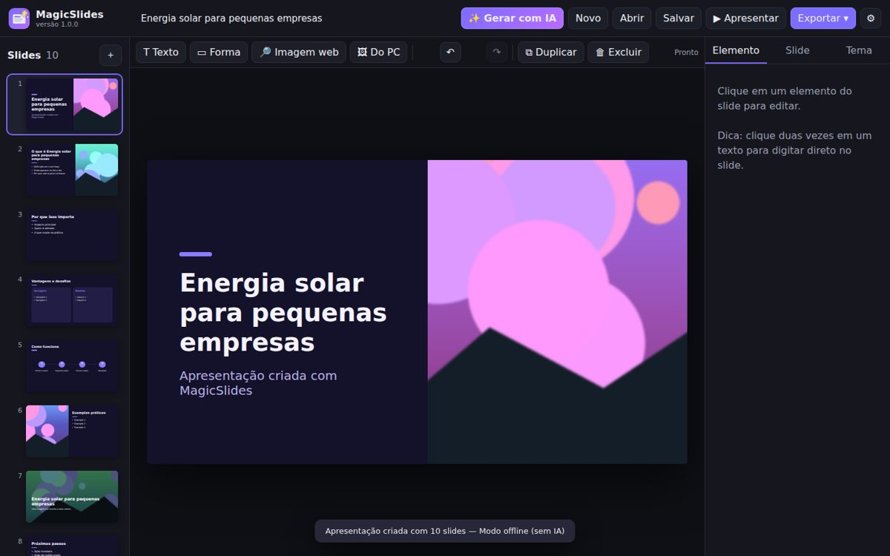
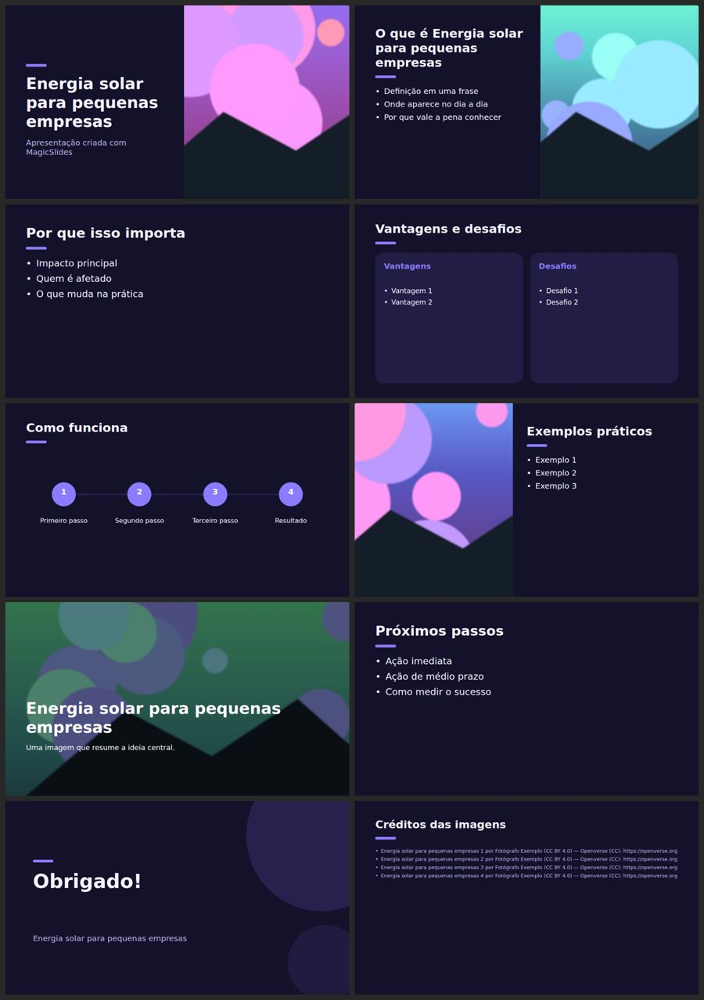

# MagicSlides

Aplicativo de desktop para Windows (também roda no Linux e no macOS) que **gera apresentações com IA e imagens buscadas na internet**, no estilo do Gamma. Você digita um tema, ou cola um texto, e recebe slides prontos com layouts variados, fotos e notas do apresentador. Depois é só editar e exportar para **PowerPoint (.pptx)** ou **HTML**.

> Evolução do projeto *Gamma Livre Core 0.1*. Projetos antigos `.gamma.json` abrem normalmente e são convertidos automaticamente.



## O que ele faz

| Recurso | Como funciona |
|---|---|
| ✨ **Gerar com IA** | Escolhe a quantidade de slides, o idioma, o estilo e o tema. A IA escreve o roteiro, escolhe o layout de cada slide e sugere a busca de imagem. |
| 🤖 **Vários provedores de IA** | **Claude (Anthropic)**, pela SDK oficial com saída estruturada; **IA local grátis** com Ollama, LM Studio ou llama.cpp; qualquer API compatível com OpenAI (OpenAI, Groq, OpenRouter); ou o **modo sem IA**, que organiza em slides o texto que você colar. |
| 🖼 **Imagens da internet** | Busca automática sem chave no **Openverse** (Creative Commons) e no **Wikimedia Commons**. Com uma chave gratuita, usa também **Pexels**, **Unsplash** e **Pixabay**. O crédito e a licença são salvos, e um slide de créditos é criado automaticamente. |
| 🎨 **11 layouts e 8 temas** | Capa, seção, tópicos, imagem à direita/esquerda, imagem em tela cheia, duas colunas, números, passos, citação e encerramento. Trocar o tema recolore a apresentação inteira. |
| ✏️ **Editor completo** | Arrastar, redimensionar, editar o texto direto no slide (duplo clique), fontes, cores, tópicos, camadas, notas do apresentador, desfazer/refazer (Ctrl+Z/Ctrl+Y) e salvamento automático. |
| ▶ **Modo apresentação** | Tela cheia (F5), navegação com as setas. |
| 📤 **Exportação** | **PowerPoint (.pptx)** editável, com imagens recortadas, transparências, tópicos e notas; **HTML** único que funciona offline, tem modo apresentação e pode ser salvo em PDF (Ctrl+P); e **projeto .json**. |



## Instalar no Windows

**Opção 1: instalador (recomendado).** Baixe o `MagicSlides-Setup-x.y.z.exe` na aba *Actions* (artefato **MagicSlides-Windows**) ou em *Releases* do GitHub e instale. Não precisa de Python nem de permissão de administrador. O app abre numa janela própria (Edge WebView2, que já vem no Windows 10 e 11).

**Opção 2: a partir do código-fonte.**
1. Instale o [Python 3.10 ou mais novo](https://www.python.org/downloads/) e marque *Add python.exe to PATH*.
2. Dê dois cliques em `instalar-windows.bat`.
3. Depois, em `executar-windows.bat`.

**Gerar o .exe você mesmo:** rode `build-windows.bat`. Ele gera `dist\MagicSlides\MagicSlides.exe` e, se o [Inno Setup](https://jrsoftware.org/isdl.php) estiver instalado, também o instalador.

### Linux / macOS
```bash
./run-linux-macos.sh        # cria o ambiente na primeira vez e abre no navegador
```

## Configurar a IA (⚙ Configurações)

| Provedor | O que preencher |
|---|---|
| **Claude** (melhor qualidade) | A chave de API de [console.anthropic.com](https://console.anthropic.com). O modelo padrão é `claude-opus-5`; para gastar menos, use `claude-sonnet-5` ou `claude-haiku-4-5`. Também é possível usar a variável de ambiente `ANTHROPIC_API_KEY`. |
| **Ollama** (grátis, offline) | Instale o [Ollama](https://ollama.com), rode `ollama pull llama3.1` e escolha o preset *Ollama*. |
| **LM Studio / llama.cpp** | Use o preset e informe o nome do modelo carregado. |
| **OpenAI / Groq / OpenRouter** | Use o preset e informe o modelo e a chave. |
| **Sem IA** | Nada a configurar. Cole títulos (`# Título`) e tópicos (`- item`) e eles viram slides. Um tema curto gera um rascunho para você completar. |

As chaves ficam só no seu computador (`%APPDATA%\MagicSlides\config.json`), nunca são enviadas ao navegador e não entram nos arquivos exportados.

## Arquitetura

```text
MagicSlides.py                 ponto de entrada (janela nativa via pywebview, ou navegador)
magicslides/
  server.py                    servidor local 127.0.0.1 + API (token por sessão, anti-CSRF)
  ai.py                        roteiro: Claude (SDK anthropic) | OpenAI-compatível | offline
  layouts.py                   roteiro → slides (11 layouts, ajuste automático do texto)
  themes.py                    8 temas; os elementos guardam "role" para recolorir
  images.py                    Openverse, Wikimedia, Pexels, Unsplash, Pixabay; download seguro
  pptx_export.py / html_export.py
  core.py                      formato canônico presentation.json + validação/migração
  static/                      editor (HTML/CSS/JS puro, sem build)
packaging/                     PyInstaller (.spec), Inno Setup (.iss), gerador de ícone
tests/                         pytest (25 testes: layouts, IA simulada, imagens, exportação, servidor)
```

O princípio do projeto original continua valendo: **`presentation.json` é a fonte da verdade**. Gerador, editor e exportadores leem e escrevem o mesmo formato.

## Desenvolvimento

```bash
pip install -r requirements-dev.txt
python -m pytest -q
python MagicSlides.py --browser        # abre no navegador
```

O GitHub Actions (`.github/workflows/magicslides-windows.yml`) roda os testes, compila o `.exe` no Windows, faz um teste de fumaça, gera o instalador e o `.zip` portátil, e anexa tudo a cada *Release* publicada.

## Limitações conhecidas

- A qualidade do texto depende do provedor. O modo offline não inventa conteúdo: ele organiza o seu texto ou cria um esqueleto para você completar.
- A busca de imagens precisa de internet. Sem resultado, o slide fica com um bloco de cor e o botão **🔎 Colocar imagem aqui**.
- Respeite a licença de cada imagem. O crédito é salvo no slide de créditos, nas notas do PPTX e no inspetor.
- PDF: exporte em HTML e use Ctrl+P → *Salvar como PDF*, ou abra o PPTX no PowerPoint e salve como PDF.
