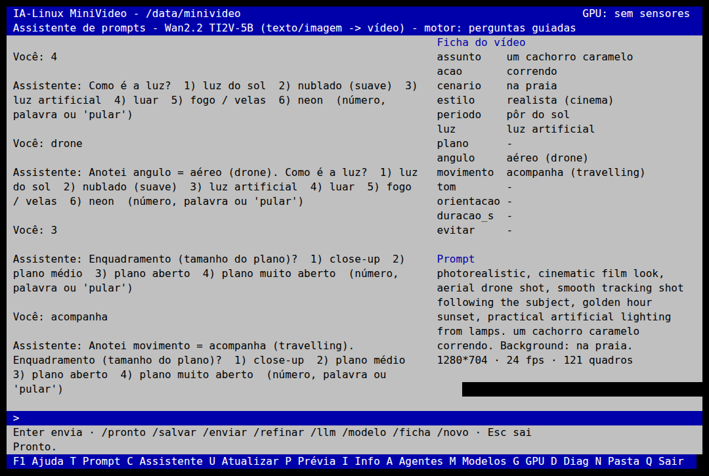
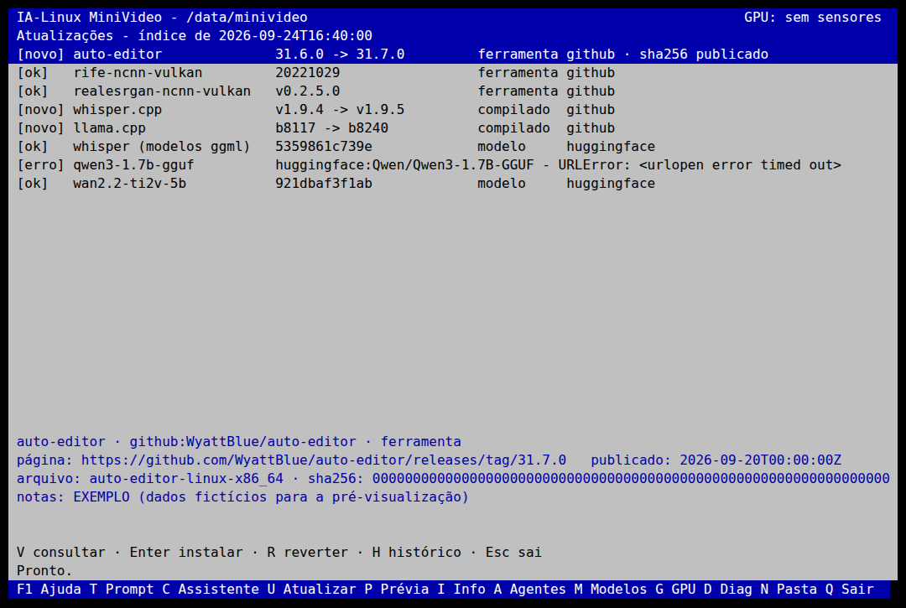

# Assistente de prompts (tecla C) e Atualizações (tecla U)

Guia para aprender usando. As duas telas seguem a regra do resto do sistema:
**nada é executado ou instalado sem você confirmar**, e todo recurso
indisponível mostra o motivo.

## 1. Assistente de prompts — tecla C



À esquerda fica a conversa; à direita, a **ficha do vídeo** e o **prompt**
sendo montado ao vivo.

### Como funciona

1. Você descreve o vídeo do seu jeito: *"um cachorro caramelo correndo na praia"*.
2. O assistente separa **quem** (assunto), **faz o quê** (ação) e **onde**
   (cenário), e pergunta o que falta: estilo, período do dia, luz,
   enquadramento, ângulo, movimento de câmera, tom de cor, orientação,
   duração e o que **não** pode aparecer (vira o prompt negativo).
3. Responda com o número da opção, uma palavra ou `pular`. Se você falar
   de outra coisa ("drone" quando ele perguntou a luz), ele anota no campo
   certo e repete a pergunta.
4. Com o essencial preenchido, `/pronto` fecha a ficha.

| Comando | O que faz |
|---|---|
| `/pronto` | termina já, com o que houver (o assunto é obrigatório) |
| `/salvar` | grava em `Projetos/<projeto>/prompts/<data>-<modelo>.json` |
| `/enviar` | manda o prompt ao terminal T (Diretor, Editor, Fiscal) |
| `/refinar` | o LLM local reescreve em inglês corrido (exige `/llm`) |
| `/llm` | liga o llama-server com o menor `.gguf` de `Modelos/llm` |
| `/modelo <id>` | `wan2.2-ti2v-5b`, `wan2.1-vace-1.3b` ou `ltx-2.3` |
| `/ficha` · `/novo` | mostra a ficha · recomeça |

Na linha de comando: `minivideo-prompts conversar`,
`minivideo-prompts gerar ficha.json --modelo ltx-2.3`.

### Dois motores

- **Perguntas guiadas (sempre funciona):** palavras-chave e uma heurística
  simples para "quem / faz o quê / onde". Não entende frases complexas.
- **Qwen local (`/llm`):** o llama-server sobe só em `127.0.0.1`. A cada fala,
  o Qwen devolve **JSON validado por schema**
  (`minivideo_prompts/schemas/conversa.schema.json`) com a ficha e a
  próxima pergunta. Rótulo fora da lista é descartado, e resposta inválida
  volta para as perguntas guiadas. O modelo só devolve texto: não executa
  nada. Tudo fica registrado no JSON salvo (campo `llm`).

Na RX 580 o Qwen3-1.7B (Q4_K_M ou Q8_0) roda com Vulkan. Coloque o `.gguf`
em `Modelos/llm/` (veja a tecla M).

### O prompt de cada modelo

| Modelo | Formato | Parâmetros |
|---|---|---|
| Wan2.2 TI2V-5B | estilo primeiro, depois etiquetas de câmera e luz, depois o conteúdo | 1280×704 ou 704×1280, 24 fps, quadros = 4n+1 |
| Wan2.1 VACE 1.3B | igual ao Wan | 832×480, 16 fps, quadros = 4n+1 |
| LTX-2.3 | parágrafo único e cronológico: ação → cenário → câmera → luz → estilo | 24 fps, quadros = 8n+1 |

- Os termos de câmera e luz vão em inglês, a língua dos dados de treino.
- A descrição que você escreveu fica em português: Wan (umT5) e LTX (Gemma)
  usam codificadores de texto multilíngues. Com `/refinar`, o Qwen
  reescreve tudo em inglês.
- O prompt negativo do Wan é uma tradução reduzida da lista padrão do
  projeto Wan (Apache-2.0).

> **Limite desta máquina:** Wan e LTX exigem NVIDIA CUDA (12 GB ou mais).
> Na RX 580 o assistente **prepara e guarda** o prompt; `/enviar` mostra o
> plano, e o Editor recusa a geração explicando que falta CUDA. O mesmo
> arquivo JSON serve depois na máquina CUDA.

**Referências usadas (sem copiar código):**
- o extensor de prompts do Wan2.2 (`wan/utils/prompt_extend.py`,
  Apache-2.0), para as dimensões de luz, período, plano, ângulo e
  composição. As regras de "substituição de conteúdo" daquele arquivo não
  foram adotadas;
- a estrutura de prompt do LTX-Video (`ltx_video/utils/prompt_enhance_utils.py`,
  Apache-2.0).

## 2. Atualizações — tecla U



(A imagem usa um índice **de exemplo**. Os números de versão dela não são reais.)

| Tecla | O que faz |
|---|---|
| `V` | consulta os repositórios acompanhados e grava o índice (só leitura) |
| `Enter` | instala a versão nova do item selecionado (pede confirmação) |
| `R` | reverte para a versão anterior (ou para a do ISO) |
| `H` | histórico de instalações e reversões |

Na linha de comando: `minivideo-atualizar verificar | listar | aplicar ID |
reverter ID | historico | caminhos`.

### O que pode ser atualizado

| Tipo | Exemplos | O que a tecla U faz |
|---|---|---|
| ferramenta | auto-editor, RIFE, Real-ESRGAN | baixa, confere, testa e ativa em `Ferramentas/<id>/<versão>` na partição MV_DADOS |
| compilado | llama.cpp, whisper.cpp | só avisa: chega com o próximo ISO (é compilado para o Xeon sem AVX2) |
| modelo | Qwen GGUF, Whisper, Wan | só avisa (revisão nova no Hugging Face); baixar com `minivideo-modelos instrucoes` |

O sistema roda da RAM (initramfs) e não se altera sozinho. As ferramentas
atualizadas entram **na frente do PATH**, então passam a valer para a
interface e para os agentes. Versão nova do sistema = ISO novo gravado no
pendrive.

### Como os conceitos de um gerenciador de pacotes aparecem aqui

| Conceito (APT, DNF, OSTree...) | No MiniVideo |
|---|---|
| **Índice de metadados** (`apt update` baixa `InRelease`/`Packages`) | `V` consulta a API de cada plataforma e grava `Ferramentas/_atualizacoes/indice.json`. Nada é baixado além dos metadados |
| **Comparação de versões** | comparação "natural": `1.10 > 1.9`, `b8240 > b8117`, `v0.2.6.0 > v0.2.5.0`, datas `20240101 > 20221029` |
| **Dependências** (`Depends:`) | campo `requer` da fonte: glibc mínima (o auto-editor exige 2.38), Vulkan. Falhou → recusa com o motivo |
| **Assinatura e hash** (GPG no `InRelease`) | sha256 publicado pela plataforma (o GitHub publica `digest` em cada arquivo; nas outras, um `SHA256SUMS` do lançamento) + TLS. Sem hash publicado → só instala com confirmação explícita, registrada no histórico |
| **Teste antes de ativar** | o binário novo precisa executar. `SIGILL` = instrução que a CPU não tem (ex.: AVX2 no Xeon X79) → recusa |
| **Atualização atômica** (OSTree, A/B) | cada versão numa pasta própria; o link `Ferramentas/<id>/atual` é trocado com `rename(2)`: vale a antiga ou a nova, nunca metade |
| **Rollback** | `R` aponta o link de volta; sem versão anterior, volta a valer a do ISO. Ficam guardadas as 2 últimas versões |
| **Deltas** (deltarpm, debdelta, deltas estáticos do OSTree, zsync) | **não implementado**: as ferramentas têm dezenas de MB e são baixadas inteiras. Candidato futuro para os modelos grandes |

**O que ainda falta para ser tão forte quanto o APT:** uma assinatura
**própria** (por exemplo, minisign ou GPG) sobre o índice. Hoje a confiança
vem do TLS e do hash publicado pela plataforma. Se a conta de um projeto
for invadida, o hash publicado também muda. Para o ISO do próprio
MiniVideo, o próximo passo é publicar um `SHA256SUMS` assinado.

### Plataformas (repositórios parecidos com o GitHub)

| Plataforma | O que é | Suporte aqui |
|---|---|---|
| **GitHub** | a maior; API de releases com sha256 por arquivo | ✅ `forja: github` |
| **GitLab** (gitlab.com ou próprio) | alternativa completa com CI/CD; Community Edition é open-source | ✅ `forja: gitlab` (+ `SHA256SUMS`) |
| **Codeberg** | sem fins lucrativos, na Alemanha, roda Forgejo | ✅ `forja: codeberg` |
| **Forgejo / Gitea** (auto-hospedado) | leves (Go), bons para servidor modesto | ✅ `forja: forgejo` ou `gitea`, com `host` |
| **Hugging Face** | repositórios de **modelos** (Git + LFS) | ✅ `forja: huggingface` (revisão + sha256 dos arquivos LFS) |
| Bitbucket | Atlassian, integração com Jira | ❌ ainda não (API de downloads diferente) |
| SourceHut | minimalista, fluxo por e-mail | ❌ ainda não |

Para acompanhar outro projeto (por exemplo, no seu próprio Forgejo), crie
`Ferramentas/_atualizacoes/fontes.json`:

```json
{"itens": [
  {"id": "minha-ferramenta", "tipo": "ferramenta", "instalada": "1.0.0",
   "fonte": {"forja": "forgejo", "host": "https://git.minha-casa.lan", "repo": "eu/minha-ferramenta"},
   "arquivo": "^minha-ferramenta-linux-x86_64$", "formato": "binario",
   "binario": "minha-ferramenta", "teste": ["--version"]}
]}
```

Só **HTTPS** é aceito, e isso vale também depois de cada redirecionamento.

### Notas sobre a explicação do Gemini (para o seu aprendizado)

A explicação está boa no geral. Três pontos para ajustar:
- **"Prelink / DRPM"**: *prelink* não tem relação com deltas. Ele
  pré-calculava endereços de bibliotecas para acelerar a carga dos
  programas. Os deltas de pacote são **deltarpm** (RPM), **debdelta**
  (Debian), os **deltas estáticos do OSTree** e o **zsync**.
- **`aptly publish update stable pki`**: o último argumento não existe.
  O correto é `aptly publish update stable`, com um prefixo opcional
  depois da distribuição.
- Detalhe do APT: a assinatura GPG fica no `InRelease` (ou `Release.gpg`).
  O `Release` lista os hashes dos arquivos `Packages`, e o `Packages` lista
  o hash de cada `.deb`. É uma corrente de hashes a partir de uma única
  assinatura.

## 3. Testes

- `tests/test_prompts.py`:
  - diálogo por regras;
  - resposta fora da pergunta;
  - `/pronto`;
  - formatos Wan/VACE/LTX (quadros 4n+1 e 8n+1);
  - salvar;
  - LLM simulado no formato OpenAI, incluindo resposta inválida → regras;
  - modo `qwen` sem servidor;
  - CLI.
- `tests/test_atualizacoes.py`: um servidor HTTP local imita as APIs de
  GitHub, GitLab (com `SHA256SUMS`), Codeberg e Hugging Face. Casos:
  - instalação, troca atômica e reversão;
  - hash adulterado;
  - item sem hash publicado;
  - zip com `../`;
  - binário com SIGILL;
  - glibc insuficiente;
  - HTTP sem TLS.
- `tests/test_ui.py`: telas C e U num terminal real (pty + pyte).

Não foi testado aqui: consulta às APIs reais (a rede deste ambiente
bloqueia Codeberg, Hugging Face e a API do GitHub) e o Qwen real. No ISO,
os dois dependem de rede e de um `.gguf` em `Modelos/llm`.
