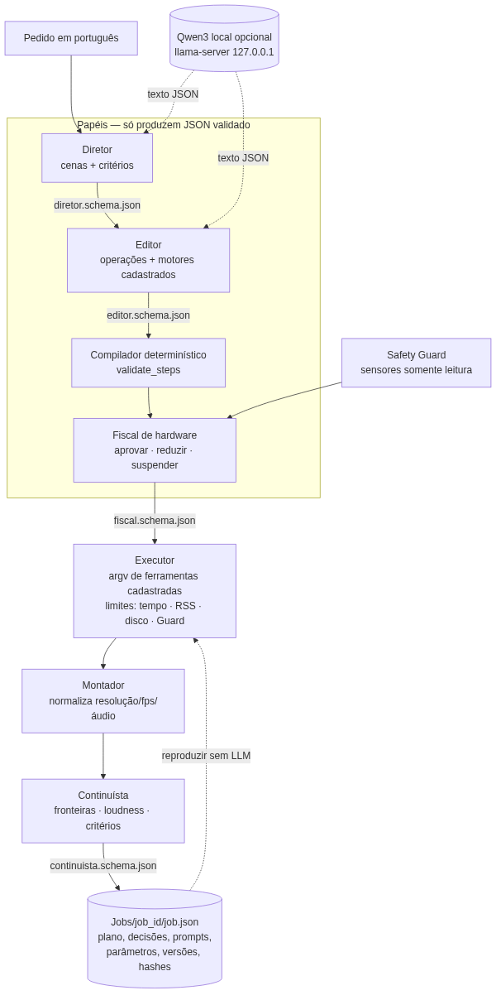
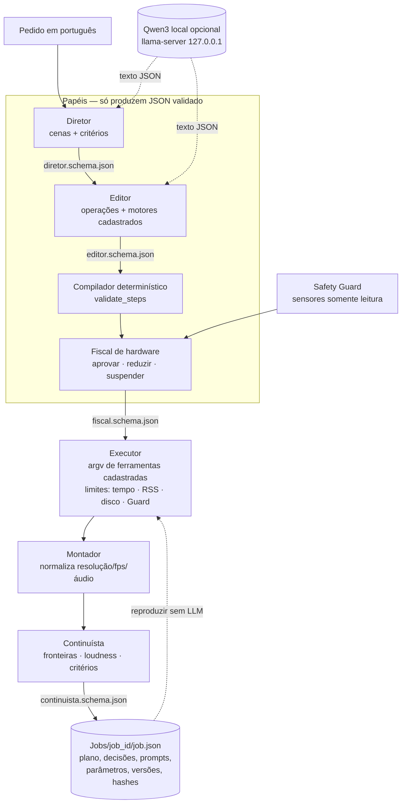

# Especialistas locais de planejamento e edição de vídeo

Protótipo com quatro papéis, **Diretor**, **Editor**, **Continuísta** e
**Fiscal de hardware**, integrado à CLI `minivideo-agentes` e à interface
de pastas (tecla `T`). Roda sem CUDA: CPU, Vulkan (RX 580) ou Vulkan por
software para teste.

## 1. Antes de alterar: o que existia e o que é novo

| Peça pedida | Situação encontrada | O que foi feito |
|---|---|---|
| CLI `mini-ia-videos`, orquestrador Qwen, adapters Wan/LTX/DFVEdit/EditCtrl, controlador de custo | **não estão no repositório** (ver `AUDITORIA.md`) | não recriados; o registro chama `mini-ia-videos` quando existir |
| Planner determinístico | `minivideo_agents/planner.py` (desta série) | reutilizado: `validate_steps` tipa todo parâmetro |
| Executor | `minivideo_agents/executor.py` | **ampliado:** limites de tempo por etapa e por job, memória (RSS da árvore de processos) e reserva de disco; loudness em duas passadas; fades nas bordas dos cortes |
| Hardware Safety Guard | `minivideo_guard/` (somente leitura) | reutilizado pelo Fiscal (decisão prévia) e pelo executor (durante a etapa) |
| Papéis com schema, Continuísta, montagem, registro reproduzível, gerenciador de modelos | inexistentes | **novos:** `minivideo_especialistas/`, `minivideo_modelos/` |

## 2. Referências consultadas (licença lida no arquivo LICENSE do repositório)

| Projeto | Licença | O que aproveitamos (ideia, não código) |
|---|---|---|
| [HKUDS/VideoAgent](https://github.com/HKUDS/VideoAgent) | MIT | registro de papéis com schemas de entrada/saída; LLM propõe um grafo JSON validado antes de executar |
| [microsoft/autogen](https://github.com/microsoft/autogen) | código MIT (docs CC-BY-4.0) | saída estruturada por agente; **o projeto está em modo de manutenção** (sucessor: Microsoft Agent Framework), por isso não é dependência |
| [ComfyUI](https://github.com/comfyanonymous/ComfyUI) | GPL-3.0 | grafo JSON enviado a `POST /prompt`; candidato a backend CUDA futuro, isolado por processo |
| [ali-vilab/VACE](https://github.com/ali-vilab/VACE) | Apache-2.0 | contrato `--src_video --src_mask --src_ref_images --prompt` do adapter futuro |
| [EditCtrl](https://github.com/yehonathanlitman/EditCtrl) | Apache-2.0 | reimplementação pública sobre DiffSynth-Studio; exige vídeo e máscara |
| [Lightricks/LTX-2](https://github.com/Lightricks/LTX-2) | **LTX Community License** (uso comercial por quem fatura ≥ US$ 10 mi/ano exige licença paga) | `python -m ltx_pipelines.ti2vid_two_stages` |
| [Wan-Video/Wan2.2](https://github.com/Wan-Video/Wan2.2) | Apache-2.0 | `generate.py --task ti2v-5B`; o README pede ≥ 24 GB de VRAM, acima do alvo de 16 GB |

Nenhum desses projetos foi instalado e nenhum modelo foi baixado.

## 3. Arquitetura





Regras de segurança:
- **Nenhum modelo executa shell.** O LLM devolve texto. O texto passa por
  `json.loads`, pelo schema do papel e pela validação semântica (cena
  existe, motor serve ao agente, parâmetros tipados). Só o compilador e o
  executor montam comandos, sempre como lista de argumentos e nunca com
  `shell=True`. Um teste varre o código-fonte em busca de `shell=True`,
  `os.system`, `eval` e `exec`.
- O orquestrador LLM só aceita URL local (`127.0.0.1`, `localhost`, `::1`).
- Modos `auto` (tenta o Qwen e volta às regras em qualquer falha), `qwen`
  (exige o modelo) e `regras`.

## 4. Schemas (`src/minivideo_especialistas/schemas/`)

JSON Schema draft 2020-12, fechados (`additionalProperties: false`), com
enums para objetivos, agentes e motores e limites numéricos. O validador
próprio (`schema.py`) recusa palavras-chave que não implementa, para não
validar "pela metade".

| Papel | Arquivo | Conteúdo |
|---|---|---|
| Diretor | `diretor.schema.json` | `cenas[]` (id `cN`, início/fim, objetivos do enum, parâmetros) e `criterios[]` (duração, altura, fps mínimo, loudness, áudio, legenda, fronteira suave) |
| Editor | `editor.schema.json` | `operacoes[]` (cena, agente, motor, params), `rejeitados[]` (objetivo e motivo real) e `montagem` (corte ou crossfade) |
| Fiscal | `fiscal.schema.json` | `decisao` geral, decisão por tarefa com `ajustes` (altura, fator), `recursos` (RAM, disco, estimativa, GPU) e `limites` |
| Continuísta | `continuista.schema.json` | `trechos[]` medidos, `fronteiras[]` (diferença visual 0–1, salto de loudness em dB, resolução, fps) e `criterios[]` (alvo, medido, ok) |
| Registro | `job.schema.json` | `minivideo-job/1`: pedido, entrada (sha256), prompts e respostas do LLM, os quatro JSONs, tarefas, limites, versões (FFmpeg, ferramentas, sha256 dos schemas), dispositivos e resultado |

## 5. Como usar (conferido nesta sessão)

```bash
minivideo-agentes motores                       # matriz CUDA / Vulkan / CPU
minivideo-agentes schemas --exportar ./schemas  # copia os schemas

# dry-run completo: Diretor + Editor + compilador + Fiscal, grava Jobs/<id>/plano.json
minivideo-agentes especialistas planejar \
  "cena 1: 00:00:00 até 00:00:02 limpe o áudio; cena 2: 00:00:03 até 00:00:05 suavize com mais quadros e melhore para 720p" \
  --entrada Midia/teste.mp4

# execução (sem CUDA) + Continuísta + registro
minivideo-agentes especialistas editar Midia/teste.mp4 "<mesmo pedido>" -o Saidas/final.mp4 --confirmar

# reproduzir sem LLM a partir do registro
minivideo-agentes especialistas reproduzir Jobs/<id>/job.json -o Saidas/rep.mp4 --confirmar

# orquestrador Qwen local (opcional)
export MINI_IA_VIDEOS_ORCHESTRATOR_URL=http://127.0.0.1:8080/v1
export MINI_IA_VIDEOS_ORCHESTRATOR_MODEL=Qwen3-1.7B
minivideo-agentes especialistas planejar "retire os silêncios e coloque legendas" --orquestrador auto
```

### Exemplo executado sem CUDA (resultado real nesta sessão)

A entrada era um vídeo de teste de 320×180, 12 fps e 5 s, com ruído. O pedido
tinha duas cenas: na primeira, limpar o áudio; na segunda, interpolar quadros
e ampliar para 720p.

- **Diretor:** 2 cenas e 7 critérios.
- **Editor:** cortador, áudio, RIFE, Real-ESRGAN e exportador. Harmonizou a
  loudness da cena 2 para evitar salto de volume.
- **Fiscal:** decidiu **reduzir**. Como a máquina de teste só tem Vulkan por
  software, o upscale ficou limitado a 480p.
- **Continuísta:** fronteira suave (visual 0,05; loudness 0,2 dB) e -16 LUFS.
  A saída final ficou em 854×480 a 24 fps. O único critério não atendido
  (altura 720) aparece com a causa: "reduzido pelo Fiscal".
- **Reprodução pelo `job.json`:** sha256 da saída **idêntico**.

Achados que o Continuísta revelou e que foram corrigidos no executor:
1. **Loudness com salto entre cenas:** o Editor passou a normalizar todas as
   cenas quando uma delas é normalizada.
2. **Montagem pelo formato da primeira cena:** desfazia o upscale e a
   interpolação. Agora usa a maior resolução e o maior fps entre os trechos.
3. **Normalização de passada única:** não atingia o alvo em trechos curtos.
   Agora são duas passadas, com ganho linear sobre os valores medidos.
4. **Clique na borda do corte:** vazamento dos quadros AAC. Agora há fades
   de 50 ms nas bordas.

## 6. Matriz de motores (`minivideo-agentes motores`)

| Motor | CPU | Vulkan | CUDA | VRAM mín. | Estado | No ISO |
|---|:-:|:-:|:-:|--:|---|:-:|
| ffmpeg | sim | – | – | – | estável | sim |
| auto-editor | sim | – | – | – | estável | sim |
| whisper.cpp | sim | sim | sim | 500 MiB | estável | sim (CPU + Vulkan) |
| rife-ncnn-vulkan | – | sim | – | 1000 MiB | estável | sim |
| realesrgan-ncnn-vulkan | – | sim | – | 1000 MiB | estável | sim |
| llama.cpp (Qwen3) | sim | sim | sim | 1500 MiB | estável | sim |
| stable-diffusion.cpp | sim | sim | sim | 4000 MiB | experimental | não |
| wan2.1-vace-1.3b | – | – | sim | 12000 MiB* | futuro | não |
| editctrl-1.3b | – | – | sim | 12000 MiB* | futuro | não |
| dfvedit-wan-1.3b | – | – | sim | 12000 MiB* | futuro | não |
| ltx-2 | – | – | sim | 16000 MiB* | futuro | não |
| wan2.2-ti2v-5b | – | – | sim | 24000 MiB (README) | futuro | não |

\* Alvo do projeto, não medição.

## 7. Testes

- `tests/test_especialistas.py`:
  - validador e schemas;
  - Diretor com uma e com várias cenas, e validação semântica;
  - Editor: só motores compatíveis, e rejeição de injeção, parâmetro extra,
    cena inexistente e montador como operação;
  - Fiscal: reduzir/pausar/crítico pela GPU, disco insuficiente e nunca
    aumentar carga;
  - LLM contra servidor HTTP local falso: saída válida, saída maliciosa com
    volta às regras, modo `qwen` falhando, URL não local recusada;
  - dry-run completo, execução real de duas cenas com reprodução idêntica,
    crossfade e Continuísta detectando salto de loudness;
  - varredura de `shell=True`, `os.system`, `eval` e `exec`.
- `tests/test_modelos.py`: detecção de formato pelo cabeçalho, inventário,
  organização sem sobrescrever, cache de hash, recomendação por hardware,
  instruções sem download e calibração com `llama-bench` falso.

## 8. Pendente (objetivo)

1. **Adapters generativos CUDA** (Wan2.1 VACE 1.3B, EditCtrl, DFVEdit,
   LTX-2, Wan2.2): catalogados no registro, mas sem execução. Exigem GPU
   NVIDIA e o código `mini-ia-videos`.
2. **Diretor/Editor com Qwen real:** o contrato foi testado com servidor
   falso. Ainda não rodou com Qwen3-0.6B ou 1.7B de verdade na RX 580.
3. **Máscaras** (necessárias para EditCtrl/VACE inpainting): sem editor de
   máscara nem agente de segmentação.
4. **Continuísta perceptual/semântico:** hoje mede diferença de quadros em
   tons de cinza e loudness. Ainda faltam SSIM/LPIPS e embeddings
   (CLIP), além do frame-âncora.
5. **Regeneração seletiva de trechos reprovados:** o Continuísta aponta,
   mas não reexecuta sozinho.
6. **Estimativa de tempo** no Fiscal (hoje só a de disco) e escalonador
   entre várias GPUs.
7. **Vídeos longos em chunks com overlap** para motores generativos.
8. **Validação física na RX 580:** sensores, Vulkan RADV, VA-API, tempos
   reais e limites de temperatura.
