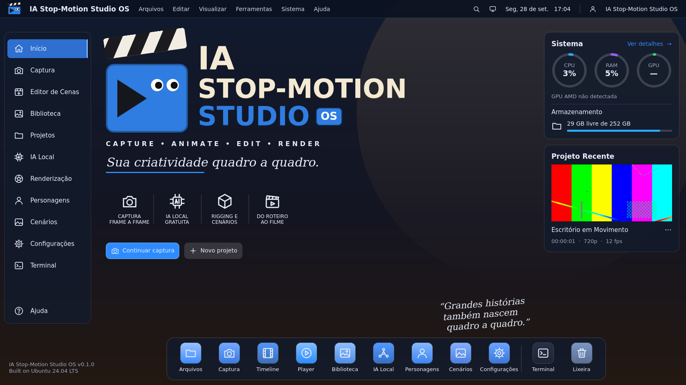
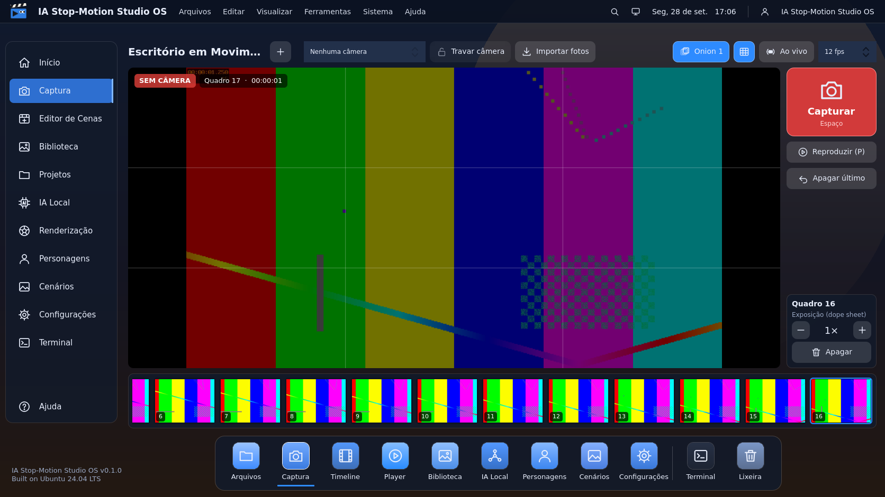
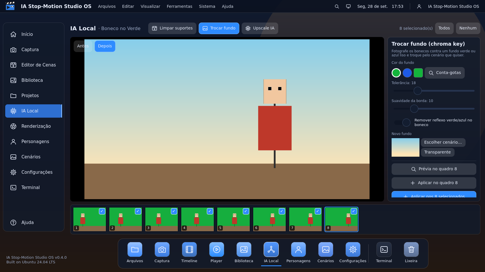
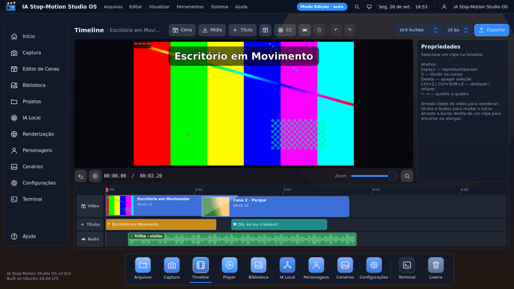

# IA Stop-Motion Studio OS

Sistema para criar filmes stop motion quadro a quadro com bonecos de pano:
captura, animação, edição e render, com IA local. Hardware alvo: Xeon X79 +
RX 580 8 GB, sobre Ubuntu 24.04 LTS.

Arquitetura completa: [`../docs/ia-linux-minimal/ia-stop-motion-studio-os-arquitetura.md`](../docs/ia-linux-minimal/ia-stop-motion-studio-os-arquitetura.md)



## O que já funciona (v0.4)

**Interface da maquete original:** barra superior, menu lateral, dock inferior,
painel Sistema (CPU, RAM, GPU, VRAM e temperatura da RX 580, armazenamento) e
Projeto Recente.

**Captura** (`Espaço` captura):
- webcam/câmera USB via QtMultimedia, com seleção da câmera
- **Travar câmera**: foco, exposição e balanço de branco em manual (Qt e V4L2 via
  `v4l2-ctl`) para evitar flicker entre as fotos
- **onion skin** de 1 a 3 quadros (`O`), grade de terços (`G`), alternar ao vivo /
  último quadro (`L`)
- cada foto é gravada **no disco na hora**, de forma atômica (arquivo temporário + fsync + rename)
- **Apagar último** (`Backspace`): o quadro vai para `<projeto>/lixeira`, não é destruído
- **dope sheet**: cada foto pode ficar 1–24 quadros na tela
- reprodução a 8/12/15/24/30 fps (`P`), tira de quadros
- **Importar fotos** já tiradas (celular, DSLR), respeitando a rotação EXIF
- **Câmeras DSLR/mirrorless** via [gPhoto2](http://gphoto.org/) (2.500+ modelos por USB):
  aparecem na lista de câmeras (🔍 procura de novo), com visualização ao vivo e
  foto em resolução total baixada direto para o projeto. Use a câmera em modo
  manual (M) e foco manual para evitar flicker

**Dope sheet e sincronia labial** (`D` mostra/esconde):
- importe a trilha de falas ou música do projeto (fica em `<projeto>/audio/`) e
  defina em que quadro ela começa
- forma de onda **por quadro**, blocos das fotos com as exposições e o lugar
  onde a próxima foto vai cair
- **Ouvir (A)**: toca o segundo de áudio até o próximo quadro; a reprodução
  (`P`) toca a animação com o som sincronizado
- **Sincronia labial** com o [Rhubarb Lip Sync](https://github.com/DanielSWolf/rhubarb-lip-sync)
  (reconhecedor fonético, funciona com português): cada quadro recebe uma boca
  A–H/X e a Captura mostra **qual boca colocar no boneco** na próxima foto.
  Instale com `scripts/instalar-rhubarb.sh`.



**IA Local** (menu lateral ou dock → IA Local), sempre guardando o original em
`<projeto>/originais/` (botão **Restaurar original**):
- **Limpar suportes e fios**: pinte sobre o suporte; com uma **placa limpa**
  (foto do cenário sem boneco — pode ser a próxima foto da Captura, um quadro ou
  um arquivo) a área vira o cenário real, com borda suavizada; sem placa, a área
  é preenchida a partir dos arredores (bom para fios finos)
- **Trocar fundo** (chroma key verde/azul) com conta-gotas, tolerância,
  suavidade de borda, remoção do reflexo verde no boneco e novo cenário (ou
  transparente)
- **Upscale IA 2×/4×** com [Real-ESRGAN ncnn-vulkan](https://github.com/xinntao/Real-ESRGAN),
  rodando na RX 580 via Vulkan. Instale com `scripts/instalar-realesrgan.sh`
- prévia **antes/depois** no quadro atual e aplicação em lote nos quadros selecionados



**Renderização:** opção **Remover flicker** (filtro `deflicker` do FFmpeg, iguala
o brilho entre fotos) e a trilha de áudio do projeto entra no vídeo. Exporta MP4 em YouTube 16:9, Reels/TikTok 9:16, Quadrado 1:1 ou
4K. Usa o encoder da GPU via VAAPI quando existe `/dev/dri/renderD128` (RX 580) e
cai para x264 na CPU se falhar.

**Timeline** (dock → Timeline), edição estilo Clipchamp:
- trilha de **vídeo** com cenas capturadas (de qualquer projeto), vídeos e fotos,
  com **dissolver** entre clipes; trilha de **títulos** e trilha de **áudio**
  (música, narração, efeitos) com volume
- **dividir** no cursor (`S`), aparar arrastando a borda direita, mover clipes,
  arrastar títulos e áudios no tempo, zoom, quadro a quadro (`←` `→`)
- monitor de pré-visualização com dissolve e títulos exatamente como no render
- formatos 16:9, 9:16, 1:1 e 4K; 12/24/25/30 fps
- **Exportar filme**: cada cena é pré-renderizada (com cache) e o filme é
  montado pelo **MLT** (`melt`), com encoder da GPU via VAAPI e fallback x264.
  O projeto também é salvo como `filme.mlt`, que abre no **Shotcut** e no **Kdenlive**.



As demais telas da maquete (Editor de Cenas, Timeline, IA Local, Personagens,
Cenários…) já existem na navegação e indicam em que etapa serão implementadas.

## Compilar e rodar (Ubuntu 24.04)

```bash
sudo apt install cmake g++ qt6-base-dev qt6-declarative-dev qt6-multimedia-dev \
  qml6-module-qtquick qml6-module-qtquick-controls qml6-module-qtquick-layouts \
  qml6-module-qtquick-window qml6-module-qtquick-dialogs qml6-module-qtmultimedia \
  qml6-module-qtqml-workerscript qml6-module-qtquick-templates \
  gstreamer1.0-plugins-base gstreamer1.0-plugins-good gstreamer1.0-plugins-bad gstreamer1.0-libav \
  ffmpeg melt v4l-utils gphoto2

cmake -S app -B build -DCMAKE_BUILD_TYPE=Release
cmake --build build -j
./build/ia-stop-motion-studio
```

Testes: `ctest --test-dir build --output-on-failure` (projeto, exportação, render da timeline com MLT, áudio, deflicker, ferramentas de imagem).
O teste de upscale roda com `IA_SMS_REALESRGAN=<caminho do realesrgan-ncnn-vulkan>`.
O teste de sincronia labial roda com `IA_SMS_RHUBARB=<caminho do rhubarb>` e `IA_SMS_TEST_SPEECH=<wav com fala>`.

Projetos ficam em `~/IA-StopMotion/Projetos/<nome>/` (`project.json`, `frames/`,
`lixeira/`, `export/`). A pasta base pode ser trocada com a variável `IA_SMS_HOME`.

Captura de tela sem monitor: `./build/ia-stop-motion-studio --screenshot tela.png captura`

## Próximas etapas

3. Biblioteca de bocas por personagem
4. Desfazer/refazer e reordenar arrastando na Timeline
5. Remoção de fundo por IA sem tela verde (rembg/U²-Net) e inpainting por IA (LaMa)
5. IA local: remover suportes/fundo, sincronia labial (Rhubarb), legendas (whisper.cpp)
6. Modos do sistema (Captura / Edição / IA / Render) com cgroups e perfis AMDGPU, depois sched_ext
7. ISO do IA Stop-Motion Studio OS
